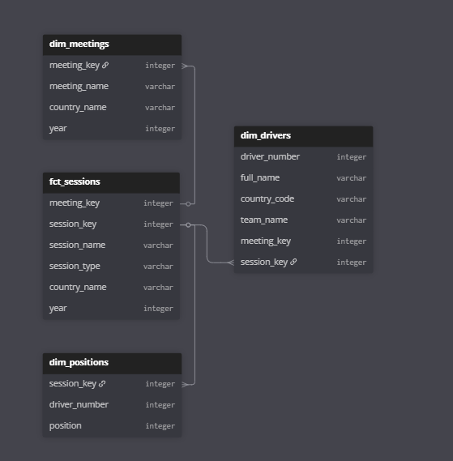

F1 data pipeline - S3 glue branch

My goal for this project is to ingest data from the openF1 API and then load the data into the bronze level in S3, use glue to transform the data into silver and then evenutally gold.

Plans:
- Pull data from OpenF1 API
- use boto to put into AWS S3 
- implement multi hop architecture (bronze, silver, gold)
- clean data and move to silver
- aggregate and move to gold
- use glue for transform and metadata
- monitor using prometheous and grafana (maybe able to do within s3?)

Currently working on:
- Investigate cloudwatch to do some monitoring
- Investigate pyDeequ for data validation
- Think about drivers table and how much duplication there is. SCD 2 might not be great because data isnt really slowly changing if it changes every week. 
- work on some data aggrigations for gold level. Season driver stats and race results stats.
- which tables to join to get some aggrigations. Think about data modeling with the tables as they are in silver. 

